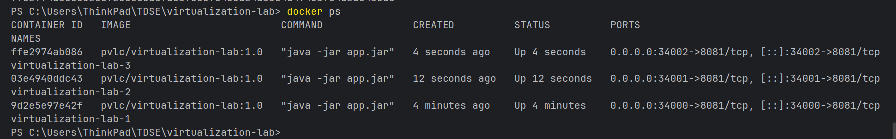
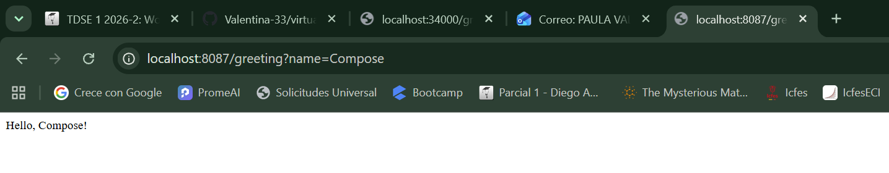
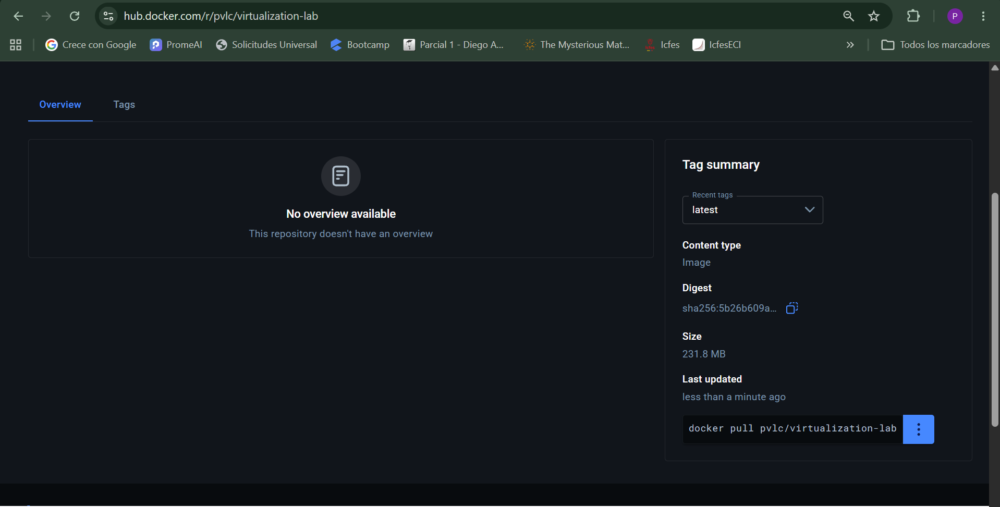
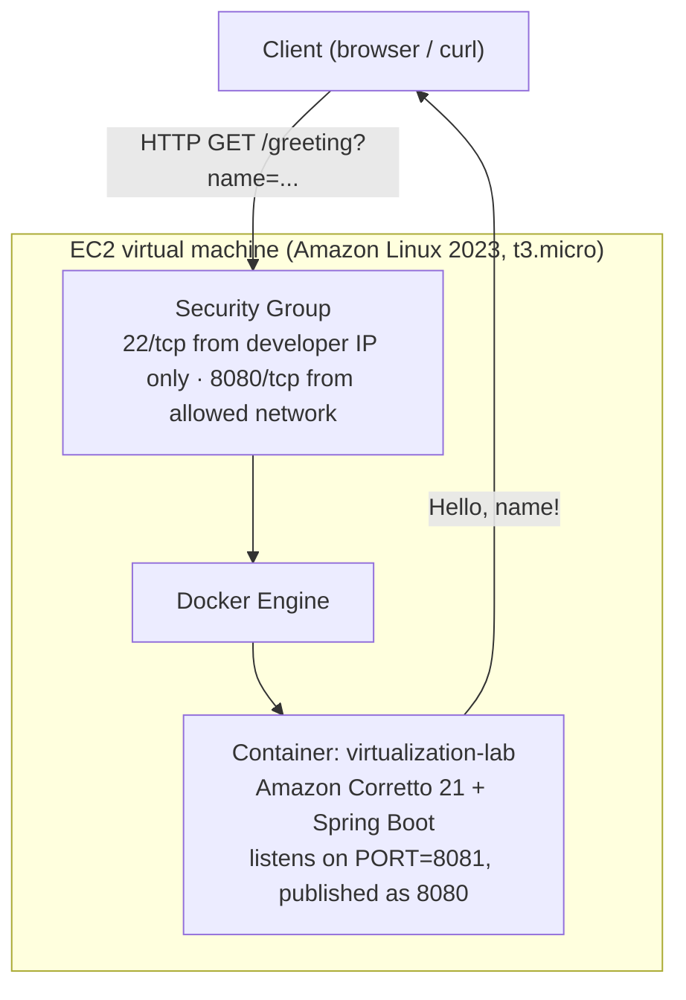
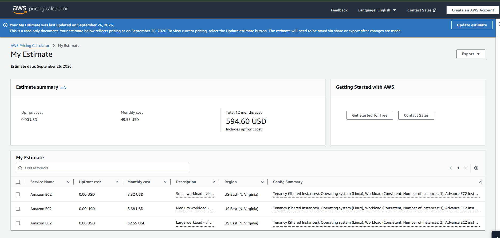

# virtualization-lab

Minimal Java web service built with Spring Boot, containerized with Docker, published to Docker
Hub, and deployed on an Amazon EC2 virtual machine. Built for the *Containerizing and Deploying a
Java Web Application* workshop, which explores virtualization as an architectural mechanism for
modularity, isolation, portability, and deployment.

## 1. Purpose

Demonstrate the full path from source code to a running cloud deployment: package a small REST
service as a Docker image, run multiple isolated instances of it on one machine, publish the image
to a public registry, deploy it on a virtual machine in AWS, and reason about what that deployment
model costs at different traffic levels.

## 2. Architecture

```
co.edu.escuelaing
├── RestServiceApplication   → Spring Boot entry point. Reads the HTTP port from the PORT
│                               environment variable (default 8081) instead of hardcoding it,
│                               so the same built artifact/image works on any host or port.
└── HelloRestController      → @RestController exposing GET /greeting?name=..., defaulting
                                to "World" when no name is supplied.
```

Two moving parts, on purpose: the entry point owns *how the app is configured and started*, the
controller owns *what the app does*. Neither depends on where it runs (local JVM, a container on a
laptop, or an EC2 instance) because the only environment-specific value — the port — is injected
from outside.

## 3. Technology stack

| Layer | Technology |
|---|---|
| Language / runtime | Java 21 (Amazon Corretto 21 inside the container) |
| Framework | Spring Boot 4.1.1 (`spring-boot-starter-web`) |
| Build | Maven 3.9+ |
| Containerization | Docker Desktop, Docker Compose v2 |
| Registry | Docker Hub |
| Cloud host | AWS EC2, Amazon Linux 2023 |

## 4. Build and run locally

```bash
mvn clean package
java -jar target/virtualization-lab-1.0.0.jar
```

The server starts on port **8081** by default. Override it with the `PORT` environment variable:

```bash
PORT=9090 java -jar target/virtualization-lab-1.0.0.jar
```

Verify:

```bash
curl "http://localhost:8081/greeting?name=Pedro"
# Hello, Pedro!
```

## 5. Docker

### Build the image

```bash
docker build -t pvlc/virtualization-lab:1.0 .
```

### Run a single container

```bash
docker run -d --name virtualization-lab-1 -e PORT=8081 -p 34000:8081 pvlc/virtualization-lab:1.0
curl "http://localhost:34000/greeting?name=Container"
```

### Container isolation

Three independent instances of the same image, each with its own process and memory, mapped to
different host ports:

```bash
docker run -d --name virtualization-lab-1 -e PORT=8081 -p 34000:8081 pvlc/virtualization-lab:1.0
docker run -d --name virtualization-lab-2 -p 34001:8081 pvlc/virtualization-lab:1.0
docker run -d --name virtualization-lab-3 -p 34002:8081 pvlc/virtualization-lab:1.0
```

Each one answers independently — stopping one does not affect the others:



## 6. Docker Compose

`compose.yaml` builds the image from the local `Dockerfile` and runs it as a single declarative
service (no database service is defined, since this application has no persistence — adding one
would contradict the workshop's own guidance not to add a database the app doesn't use):

```yaml
services:
  web:
    build: .
    container_name: virtualization-web
    environment:
      PORT: 8081
    ports:
      - "8087:8081"
```

```bash
docker compose up -d --build
docker compose ps
docker compose logs web
curl "http://localhost:8087/greeting?name=Compose"
```



## 7. Docker Hub

**Repository:** [hub.docker.com/r/pvlc/virtualization-lab](https://hub.docker.com/r/pvlc/virtualization-lab)

```bash
docker login
docker tag pvlc/virtualization-lab:1.0 pvlc/virtualization-lab:latest
docker push pvlc/virtualization-lab:1.0
docker push pvlc/virtualization-lab:latest
```



## 8. AWS EC2 deployment

**Instance:** Amazon Linux 2023, `t3.micro`, region `us-east-1` (N. Virginia).
**Security group:** SSH (22) restricted to the developer's own IP; the application port open only
to the network that needs access — no other inbound ports exposed.

Setup, once connected over SSH:

```bash
sudo yum update -y
sudo yum install -y docker
sudo service docker start
sudo usermod -a -G docker ec2-user
# log out and reconnect for the group change to take effect
```

Pull and run the published image:

```bash
docker pull pvlc/virtualization-lab:1.0

docker run -d \
  --name virtualization-lab \
  --restart unless-stopped \
  -e PORT=8081 \
  -p 8080:8081 \
  pvlc/virtualization-lab:1.0
```

Verify:

```bash
docker ps
docker logs virtualization-lab
curl "http://localhost:8080/greeting?name=AWS"
```

**Public deployment URL:** `http://<ec2-public-dns>:8080/greeting?name=AWS`
*(fill in once the instance is running — see [`docs/ec2-deployment.png`](docs/ec2-deployment.png) and [`docs/ec2-endpoint.png`](docs/ec2-endpoint.png) below)*

> 📌 **Pending evidence** — add after deploying:
> - `docs/ec2-deployment.png` — `docker ps` / `docker logs` on the instance showing the container running.
> - `docs/ec2-endpoint.png` — the public URL responding in a browser or via `curl` from outside the instance.
> - Replace `<ec2-public-dns>` above with the real address, and terminate the instance once the evidence is collected.

## 9. Deployment model



| Layer | Responsibility |
|---|---|
| **EC2 virtual machine** | Isolated compute, memory, storage, and network resources rented by the hour; the unit AWS bills for regardless of how many requests it serves. |
| **Security group** | Stateful firewall controlling exactly which inbound traffic can reach the instance — SSH restricted to the developer, the app port restricted to the network that needs it. |
| **Docker container** | Portable execution environment bundling the application with its exact runtime (Corretto 21) — the same image that ran locally, unmodified. |
| **Java web application** | Receives HTTP requests and provides the business logic (`/greeting`), independent of the infrastructure it happens to run on. |

## 10. Cost analysis

### Assumptions

All three scenarios use On-Demand pricing in **US East (N. Virginia)**, a Linux EBS-backed
instance, `gp3` storage, and an average request/response pair of roughly 1 KB (a short JSON/text
body plus HTTP headers — this endpoint returns a few words, no payload of consequence). The
service is assumed to run **continuously** (constant usage, 730 instance-hours/month) rather than
on a schedule, since there is no fixed traffic window to switch it off for.

| | Small workload | Medium workload | Large workload |
|---|---|---|---|
| Monthly requests | 10,000 | 100,000 | 1,000,000 |
| Region | us-east-1 | us-east-1 | us-east-1 |
| Instance type | t3.micro | t3.micro | t3.small |
| Number of instances | 1 | 1 | 2 |
| Monthly runtime | 730 h (24/7) | 730 h (24/7) | 730 h (24/7) each |
| EBS storage | 8 GB gp3 | 8 GB gp3 | 8 GB gp3 each (16 GB total) |
| Outbound data transfer | ~1 GB | ~5 GB | ~10 GB |
| Avg request/response size | ~1 KB | ~1 KB | ~1 KB |
| Continuous or scheduled | Continuous | Continuous | Continuous |
| High availability required | No | No | Yes — 2 instances for redundancy |

The jump to two instances in the Large scenario is **not** driven by raw compute demand — a single
`t3.micro` could still serve 1,000,000 requests/month of this size without strain. It reflects an
availability decision (no single point of failure once the service is business-critical enough to
justify redundancy), which is the more realistic reason to add capacity for a lightweight endpoint
like this one (see the discussion below).

### AWS Pricing Calculator estimate

Estimate built with the [AWS Pricing Calculator](https://calculator.aws), covering EC2 compute,
EBS storage, and outbound data transfer for all three scenarios in one estimate.

**Public link (view-only, expires after 1 year):**
[calculator.aws/#/estimate?id=6ad35996aa0db59bba7d7ea2185f3181ebb09a0f](https://calculator.aws/#/estimate?id=6ad35996aa0db59bba7d7ea2185f3181ebb09a0f)


*(screenshot of the link above — see the pending-evidence note at the end of this section)*

### Cost table

| Scenario | Monthly requests | Monthly infrastructure cost | Estimated cost per request | Main cost drivers |
|---|---|---|---|---|
| Small workload | 10,000 | USD 8.32 | USD 0.000832 | EC2 instance-hours (≈ 91% of the total); storage and transfer are marginal |
| Medium workload | 100,000 | USD 8.68 | USD 0.0000868 | Same fixed EC2 runtime and storage; slightly more outbound transfer |
| Large workload | 1,000,000 | USD 32.55 | USD 0.0000326 | A second `t3.small` instance for redundancy, plus its storage and transfer |
| **Total (all three)** | 1,110,000 | **USD 49.55/month** (USD 594.60/year) | — | — |

### Architectural discussion

**Why does an EC2-based deployment have a baseline monthly cost even when the application receives
few requests?**
EC2 bills for *reserved compute capacity over time* (instance-hours), not per request. An instance
is a rented virtual machine that must stay running for the app to be reachable at all, whether it
serves one request or a million that month. In the Small scenario, USD 7.59 of the USD 8.32 total
(≈ 91%) is the `t3.micro` instance itself — storage and transfer barely move the needle, because
they scale with actual usage while the instance cost does not.

**At which workload level does the fixed cost become less significant per request?**
Since the instance cost stays flat while traffic grows, cost-per-request keeps falling as volume
increases on the same instance: USD 0.000832 → USD 0.0000868 → USD 0.0000326 across the three
scenarios, a ~25x improvement from Small to Large. There is no single threshold where the fixed
cost "stops mattering" — it just keeps amortizing better — until the workload outgrows what one
instance can serve, at which point a *new* fixed cost (a second instance) resets the curve.

**What would force you to move from one EC2 instance to multiple instances?**
For an endpoint this light, not raw throughput — a single `t3.micro` could handle far more than
1,000,000 requests/month of this size. The real forcing functions are architectural: eliminating a
single point of failure once the service is business-critical, enabling zero-downtime rolling
deployments, spreading load across availability zones for resilience, or (for a heavier real
workload) hitting a memory/connection ceiling the instance size can't absorb.

**Which additional services would a production deployment likely require?**
An Application Load Balancer in front of multiple instances (traffic distribution plus health
checks), a managed database (RDS) if the app gained persistence, CloudWatch for monitoring and
alarms, automated EBS snapshot backups, a private container registry (ECR) instead of a public
Docker Hub repository, and likely an Auto Scaling Group plus Route 53/ACM for DNS and TLS.

**Would a serverless deployment be more cost-effective for the small-workload scenario?**
Very likely, for this specific workload's characteristics. The Small scenario is low-volume
(10,000 requests/month — about one every four minutes), bursty rather than steady, and each
request does trivial, short-lived compute with no persistent state or long-running connections —
exactly the profile serverless pricing rewards, since AWS Lambda (with API Gateway or a Function
URL) bills per invocation and per millisecond of actual execution, with **no idle cost** between
requests. AWS's Lambda free tier (1,000,000 requests and 400,000 GB-seconds of compute per month)
would plausibly cover this entire scenario at USD 0, versus a fixed USD 8.32/month on EC2 that is
paid whether or not any request ever arrives. EC2 becomes the better fit as traffic gets large and
*steady* enough that a flat instance cost undercuts summing per-invocation charges, or when the
workload needs something serverless handles poorly — long-lived connections, specialized runtime
control, or latency guarantees Lambda's cold starts can't offer.

### Conclusion

For the Small and Medium scenarios, EC2 is a defensible but not obviously optimal choice: it works
correctly and the absolute cost is low (under USD 9/month), but almost all of that cost is idle
capacity paid for regardless of traffic — a serverless deployment would likely serve the same
workload for less. EC2 earns its keep once traffic is large and continuous enough that its fixed
cost is spread thin (the Large scenario's USD 0.0000326/request) and once the deployment needs
things a container on a VM gives you for free — full control over the runtime, no cold starts, and
a straightforward path to attaching a load balancer, more instances, or other AWS services as the
system grows. For this workshop's actual traffic (a handful of manual test requests), any of the
three tiers is functionally interchangeable; the exercise's value is in seeing *why* the numbers
move the way they do as volume changes, not in picking a "winning" scenario.

## 11. Evidence

| Evidence | File |
|---|---|
| Local execution (`curl`/browser hitting `/greeting`) | Section 4 above |
| Isolated Docker containers | [`docs/docker-isolated-containers.png`](docs/docker-isolated-containers.png) |
| Docker Compose running locally | [`docs/compose-local-run.png`](docs/compose-local-run.png) |
| Docker Hub repository | [`docs/dockerhub-repo.png`](docs/dockerhub-repo.png) |
| EC2 deployment running | `docs/ec2-deployment.png` — pending |
| Public EC2 endpoint responding | `docs/ec2-endpoint.png` — pending |
| AWS Pricing Calculator estimate | `docs/aws-pricing-calculator.png` — pending (public link above already live) |

A short video demonstrating the local Docker deployment and the EC2 deployment working accompanies
this repository's submission.
