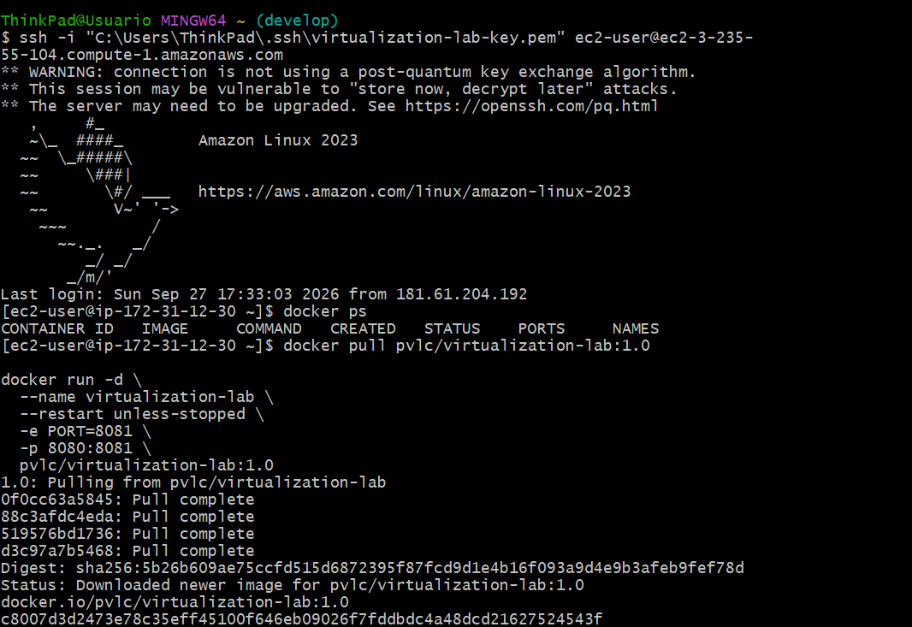
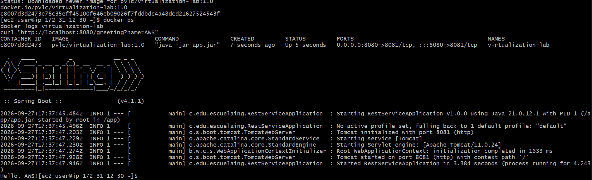
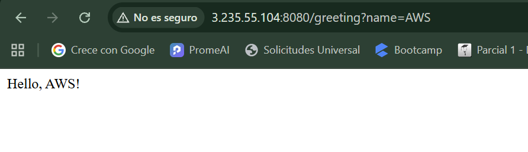
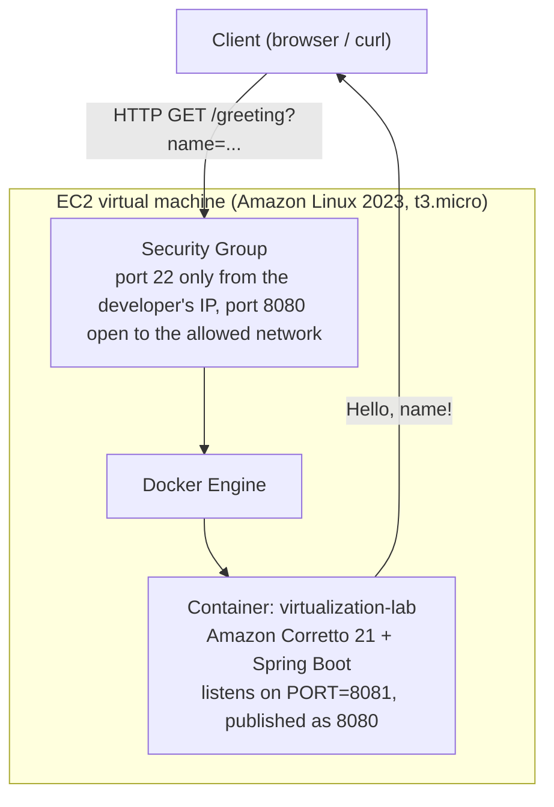

# virtualization-lab

Small Java web service built with Spring Boot. It is packaged as a Docker image, published to
Docker Hub, and deployed on an Amazon EC2 virtual machine. This project was made for the
*Containerizing and Deploying a Java Web Application* workshop, which looks at virtualization as a
way to get modularity, isolation, portability and easy deployment.

## 1. Purpose

Show the full path from source code to a working cloud deployment: package a small REST service as
a Docker image, run several isolated copies of it on one machine, publish the image to a public
registry, deploy it on a virtual machine in AWS, and think about what that setup costs at
different traffic levels.

## 2. Architecture

```
co.edu.escuelaing
├── RestServiceApplication   → Spring Boot entry point. Reads the HTTP port from the PORT
│                               environment variable (8081 by default) instead of hardcoding it,
│                               so the same jar or image works on any host or port.
└── HelloRestController      → @RestController that exposes GET /greeting?name=..., and
                                answers "World" when no name is given.
```

There are only two classes on purpose. The entry point takes care of how the app starts and gets
configured. The controller takes care of what the app actually does. Neither one cares where it
runs (a local JVM, a container on a laptop, or an EC2 instance), because the only thing that
changes between environments, the port, comes from outside the code.

## 3. Technology stack

| Layer | Technology |
|---|---|
| Language / runtime | Java 21 (Amazon Corretto 21 inside the container) |
| Framework | Spring Boot 4.1.1 (`spring-boot-starter-web`) |
| Build | Maven 3.9+ |
| Containerization | Docker Desktop, Docker Compose v2 |
| Registry | Docker Hub |
| Cloud host | AWS EC2, Amazon Linux 2023 |

## 4. Build and run locally

```bash
mvn clean package
java -jar target/virtualization-lab-1.0.0.jar
```

The server starts on port **8081** by default. You can change it with the `PORT` variable:

```bash
PORT=9090 java -jar target/virtualization-lab-1.0.0.jar
```

Check it works:

```bash
curl "http://localhost:8081/greeting?name=Pedro"
# Hello, Pedro!
```

## 5. Docker

### Build the image

```bash
docker build -t pvlc/virtualization-lab:1.0 .
```

### Run a single container

```bash
docker run -d --name virtualization-lab-1 -e PORT=8081 -p 34000:8081 pvlc/virtualization-lab:1.0
curl "http://localhost:34000/greeting?name=Container"
```

### Container isolation

Three copies of the same image, each one its own process with its own memory, mapped to different
ports on the host:

```bash
docker run -d --name virtualization-lab-1 -e PORT=8081 -p 34000:8081 pvlc/virtualization-lab:1.0
docker run -d --name virtualization-lab-2 -p 34001:8081 pvlc/virtualization-lab:1.0
docker run -d --name virtualization-lab-3 -p 34002:8081 pvlc/virtualization-lab:1.0
```

Each one answers on its own. Stopping one does not affect the others:


## 6. Docker Compose

`compose.yaml` builds the image from the local `Dockerfile` and runs it as one service. There is
no database service here, because this app does not store any data, and adding one just to have
one would go against what the workshop asks for:

```yaml
services:
  web:
    build: .
    container_name: virtualization-web
    environment:
      PORT: 8081
    ports:
      - "8087:8081"
```

```bash
docker compose up -d --build
docker compose ps
docker compose logs web
curl "http://localhost:8087/greeting?name=Compose"
```


## 7. Docker Hub

**Repository:** [hub.docker.com/r/pvlc/virtualization-lab](https://hub.docker.com/r/pvlc/virtualization-lab)

```bash
docker login
docker tag pvlc/virtualization-lab:1.0 pvlc/virtualization-lab:latest
docker push pvlc/virtualization-lab:1.0
docker push pvlc/virtualization-lab:latest
```


## 8. AWS EC2 deployment

**Instance:** Amazon Linux 2023, `t3.micro`, region `us-east-1` (N. Virginia).
**Security group:** SSH (22) only from the developer's own IP. The application port is open only
to the network that needs it, and no other port is exposed.

Setup, after connecting over SSH:

```bash
sudo yum update -y
sudo yum install -y docker
sudo service docker start
sudo usermod -a -G docker ec2-user
# log out and connect again so the docker group takes effect
```



Pull and run the published image:

```bash
docker pull pvlc/virtualization-lab:1.0

docker run -d \
  --name virtualization-lab \
  --restart unless-stopped \
  -e PORT=8081 \
  -p 8080:8081 \
  pvlc/virtualization-lab:1.0
```

Check it from inside the instance:

```bash
docker ps
docker logs virtualization-lab
curl "http://localhost:8080/greeting?name=AWS"
```



**Public deployment URL:** `http://ec2-3-235-55-104.compute-1.amazonaws.com:8080/greeting?name=AWS`



## 9. Deployment model



| Layer | What it does |
|---|---|
| **EC2 virtual machine** | Compute, memory, storage and network you rent by the hour. This is what AWS charges for, no matter how many requests it serves. |
| **Security group** | A firewall that decides which traffic can reach the instance. SSH is limited to the developer, the app port is limited to whoever actually needs it. |
| **Docker container** | Packages the app together with the exact runtime it needs (Corretto 21). It is the same image that ran locally, nothing changes for the deployment. |
| **Java web application** | Handles the HTTP requests and returns the greeting. It does not know or care what infrastructure it is running on. |

## 10. Cost analysis

### Assumptions

All three scenarios use On-Demand pricing in **US East (N. Virginia)**, a Linux instance with
`gp3` storage, and an average request/response pair of around 1 KB (this endpoint just returns a
short greeting plus HTTP headers, nothing bigger). The service is assumed to run all the time
(constant usage, 730 instance-hours a month) instead of on a schedule, since there is no fixed time
window where it makes sense to turn it off.

| | Small workload | Medium workload | Large workload |
|---|---|---|---|
| Monthly requests | 10,000 | 100,000 | 1,000,000 |
| Region | us-east-1 | us-east-1 | us-east-1 |
| Instance type | t3.micro | t3.micro | t3.small |
| Number of instances | 1 | 1 | 2 |
| Monthly runtime | 730 h (24/7) | 730 h (24/7) | 730 h (24/7) each |
| EBS storage | 8 GB gp3 | 8 GB gp3 | 8 GB gp3 each (16 GB total) |
| Outbound data transfer | ~1 GB | ~5 GB | ~10 GB |
| Avg request/response size | ~1 KB | ~1 KB | ~1 KB |
| Continuous or scheduled | Continuous | Continuous | Continuous |
| Needs high availability | No | No | Yes, 2 instances for redundancy |

Going from one instance to two in the Large scenario is not really about needing more compute
power. A single `t3.micro` could still handle 1,000,000 of these light requests a month without
trouble. It is an availability decision: once the service is important enough that it cannot have
a single point of failure, you add a second instance for redundancy. That is a more realistic
reason to scale a lightweight service like this one, and it comes up again in the discussion below.

### AWS Pricing Calculator estimate

Estimate built with the [AWS Pricing Calculator](https://calculator.aws), covering EC2 compute,
EBS storage and outbound data transfer for the three scenarios.

**Public link (view only, expires after 1 year):**
[calculator.aws/#/estimate?id=6ad35996aa0db59bba7d7ea2185f3181ebb09a0f](https://calculator.aws/#/estimate?id=6ad35996aa0db59bba7d7ea2185f3181ebb09a0f)


### Cost table

| Scenario | Monthly requests | Monthly infrastructure cost | Estimated cost per request | Main cost drivers |
|---|---|---|---|---|
| Small workload | 10,000 | USD 8.32 | USD 0.000832 | The EC2 instance itself (around 91% of the total); storage and transfer barely add anything |
| Medium workload | 100,000 | USD 8.68 | USD 0.0000868 | Same fixed instance and storage, a bit more data transfer |
| Large workload | 1,000,000 | USD 32.55 | USD 0.0000326 | A second `t3.small` instance for redundancy, plus its own storage and transfer |
| **Total (all three)** | 1,110,000 | **USD 49.55/month** (USD 594.60/year) | n/a | n/a |

### Architectural discussion

**Why does an EC2-based deployment have a baseline monthly cost even when the application receives
few requests?**
Because EC2 charges for the time the instance is reserved, not for how many requests it answers.
The virtual machine has to keep running for the app to be reachable at all, whether it gets one
request or a million that month. In the Small scenario, USD 7.59 out of the USD 8.32 total (about
91%) is just the `t3.micro` instance. Storage and data transfer barely move the number, because
those scale with real usage while the instance cost does not.

**At which workload level does the fixed cost become less significant per request?**
Since the instance cost stays the same while traffic grows, the cost per request keeps getting
smaller as volume increases on the same instance: USD 0.000832, then USD 0.0000868, then USD
0.0000326 across the three scenarios, about 25 times cheaper per request from Small to Large.
There is no single point where the fixed cost stops mattering. It just keeps spreading thinner
until the workload outgrows what one instance can handle, and then a new fixed cost (a second
instance) resets the curve.

**What would force you to move from one EC2 instance to multiple instances?**
For a service this light, it is not really about how many requests it can process. A single
`t3.micro` could handle far more than 1,000,000 requests a month of this size. The real reasons to
add instances are architectural: removing a single point of failure once the service matters
enough, being able to deploy new versions without downtime, spreading load across availability
zones for resilience, or, for a heavier real workload, hitting a memory or connection limit the
instance size cannot handle anymore.

**Which additional services would a production deployment likely require?**
A load balancer in front of several instances (to split traffic and check their health), a managed
database if the app needed to store data, CloudWatch for monitoring and alerts, automatic backups
for the storage, a private container registry instead of a public Docker Hub repository, and
probably an auto scaling group plus DNS and TLS through Route 53 and ACM.

**Would a serverless deployment be more cost-effective for the small-workload scenario?**
Probably yes, for this specific case. The Small scenario is low traffic, about one request every
four minutes, and each request does a small amount of work with no state to keep between calls.
That is exactly the kind of workload serverless pricing is good for, since AWS Lambda only charges
for the time it actually spends running, with no cost while it sits idle. Lambda's free tier
(1,000,000 requests and 400,000 GB-seconds a month) would likely cover this whole scenario for
free, compared to a fixed USD 8.32 a month on EC2 that gets charged whether a request shows up or
not. EC2 starts making more sense once traffic is large and steady enough that a flat instance
price beats adding up per-request charges, or when the app needs something serverless is not great
at, like long-lived connections or predictable low latency without cold starts.

### Conclusion

For the Small and Medium scenarios, EC2 works fine and does not cost much (under USD 9 a month),
but most of that money pays for capacity that sits idle most of the time. A serverless setup would
probably serve the same traffic for less. EC2 starts to make more sense once traffic is high and
steady enough that the fixed cost gets spread over a lot of requests, like the Large scenario's
USD 0.0000326 per request, and once the deployment needs things a container on a VM gives you for
free: full control over the runtime, no cold starts, and an easy path to add a load balancer, more
instances, or other AWS services later. For the actual traffic this workshop generates, a handful
of manual test requests, any of the three tiers works fine. The point of the exercise is
understanding why the numbers change the way they do as volume grows, not picking a "winner".

## 11. Evidence

| Evidence | File |
|---|---|
| Local execution (`curl`/browser hitting `/greeting`) | Section 4 above |
| Isolated Docker containers | [`docs/docker-isolated-containers.png`](docs/docker-isolated-containers.png) |
| Docker Compose running locally | [`docs/compose-local-run.png`](docs/compose-local-run.png) |
| Docker Hub repository | [`docs/dockerhub-repo.png`](docs/dockerhub-repo.png) |
| Connecting to the EC2 instance and pulling the image | [`docs/ec2-ssh-connect.png`](docs/ec2-ssh-connect.png) |
| Container running on EC2 | [`docs/ec2-deployment.png`](docs/ec2-deployment.png) |
| Public EC2 endpoint answering | [`docs/ec2-endpoint.png`](docs/ec2-endpoint.png) |
| AWS Pricing Calculator estimate | [`docs/aws-pricing-calculator.png`](docs/aws-pricing-calculator.png) |

A short video showing the local Docker deployment and the EC2 deployment working goes together
with this repository's submission.
